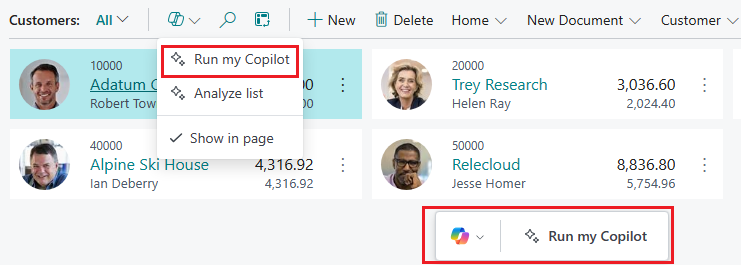

# Launch Copilot experience

In this article, you learn how to add an action in the UI that users select to start the Copilot experience. This task is done similar to the way you add an action that opens any page. Except in this case, you target the prompt dialog page for your Copilot extension. You also apply a specific image so that users can easily recognize that the action is related to a Copilot feature.

## Add an action for your Copilot

The following code illustrates how to add an action that opens the prompt dialog page for Copilot:  

```al
action(GenerateCopilot)
{
    Caption = 'Draft with Copilot';
    Image = Sparkle;

    trigger OnAction()
    begin
        Page.RunModal(Page::"My Copilot");
    end;
}
```

Set the [Image property](properties/devenv-image-property.md) to either `Sparkle` 
or `SparkleFilled` . These images are recognized across Microsoft products to indicate that the action is associated with Copilot.

In general, use the `Sparkle` icon. Reserve the `SparkleFilled` icon for special cases where you want to emphasize a specific Copilot. For example, if there are multiple Copilot actions on a page, you might want to emphasize one Copilot action over the others.  

## Promote Copilot using prompt action 

You can create a prompt action to promote your Copilot on pages and encourage users to use it. A prompt action is a standard action that appears under the  in the action bar and in the Copilot toolbar that floats on the page for easy access. Users can hide Copilot toolbar by selecting the **Hide** action on the toolbar or **Show in page** in the action bar.



Prompt actions are supported on `List`, `ListPage`, `StandardDialog`, and `WorkSheet` page types in versions prior to [!INCLUDE [prod_short](includes/prod_short.md)] 2024 release wave 2. Starting with [!INCLUDE [prod_short](includes/prod_short.md)] 2024 release wave 2, page types `Card`, `Document`, and `ListPlus` are also supported.

To create a prompt action, add an action area called `area(Prompting)` to the page and an `action` that runs the prompt dialog page. 

```al
...
actions
{
    area(Prompting)
    {
        action(MyPromptAction)
        {
            ApplicationArea = All;
            Caption = 'Run my Copilot';
            RunObject = page "Copilot Job Proposal";
        }
    }
}
...
```

Here's an example if you're extending a list page:

```al
...

actions
{
    addlast(Prompting)
    {
        action(MyPromptAction)
        {
            ApplicationArea = All;
            Caption = 'Run my Copilot';
            RunObject = page "Copilot Job Proposal";
        }
    }
}
...
```

[Learn more about prompting using a floating action bar](devenv-page-prompting-floating-actionbar.md).

## Next steps

- [Design Copilot prompt mode](copilot-design-prompt-mode.md)
- [Design Copilot content mode](copilot-design-content-mode.md)
- [Customize Copilot generate mode](copilot-customize-generate-mode.md)
