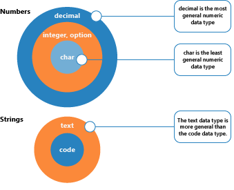

# Type conversion in AL expressions

This article describes type conversions in AL expressions.  

## AL expression statements and type conversion

Consider the following statements.  

```AL
var
    CharVar: Char;
    integerVar: Integer;
    Sum: Integer;
begin
    CharVar := 15; 
    integerVar := 56000; 
    Sum := CharVar + integerVar;  
end
```  

The last statement involves one or two type conversions. The rightmost statement involves the evaluation of the expression `CharVar + integerVar` \(char + integer\). In order to evaluate this expression, the first operand \(CharVar\) must be converted from `char` to `integer`. The addition operator then returns an integer result.  

If the type of the leftmost variable is declared as, for example, `Decimal`, the result must be converted from integer to decimal before its value can be assigned to `Sum`. For more information, see [AL variables](devenv-variables.md#assignment-type-conversion).  

The following examples illustrate the type conversions, which can occur when expressions are evaluated. The following guidelines are used:  

- When asked to evaluate an expression of mixed data types, if it's possible, the system always converts at least one of the operands to a more general data type.  
- The data types in the two main groups, numbers and strings, can be ranked from "most general" to "least general."  

     

- The most general data types include all the possible values from the less general data types; a decimal is more general than an integer, which is more general than a char.  
- Type conversion can occur in some cases even though two operands have the same type.  

These rules are illustrated by the following examples.  

## Example 1

The following example shows the evaluation of a numeric expression.  

```  
integer + decimal  
```  

This expression contains two sub expressions of different data types. Before it can add these two sub expressions, the system must convert the leftmost sub expression to decimal.  

```  
decimal + decimal  
```  

When the leftmost sub expression has been converted, the expression can be evaluated, and the resulting data type will be decimal.  

```  
decimal + decimal = decimal  
```  

## Example 2

The following example shows the evaluation of a string expression.  

```  
text + code  
```  

This expression contains two sub expressions that must be concatenated. To do this, the system must convert the sub expression of the least general data type \(code\) to the most general data type \(text\).  

```  
text + text  
```  

When the rightmost argument has been converted, the expression can be evaluated, and the resulting data type will be text.  

```  
text + text = text  
```

## See also

[AL variables](devenv-variables.md#assignment-type-conversion)  