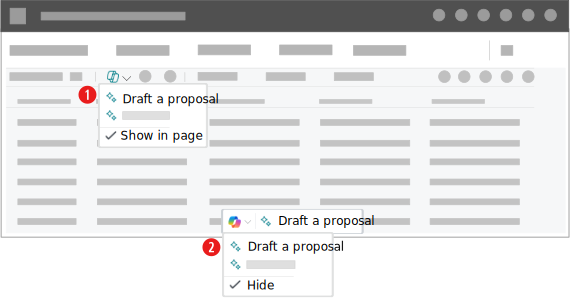

# Prompting using a floating action bar

In this article, you learn how to add an action in the UI that users select to start the Copilot feature. This task is done similar to the way you add an action that opens any page. Except in this case, you target the prompt dialog page for your Copilot feature. You also apply a specific image so that users can easily recognize that the action is related to a Copilot feature.

## Add action that runs the prompt dialog page for Copilot feature

The following code illustrates how to add an action that opens the prompt dialog page for Copilot feature:  

```al
action(MyPromptDialogAction)
{
    Caption = 'Create draft';
    Image = Sparkle;

    trigger OnAction()
    begin
        Page.RunModal(Page::"My Prompt Dialog");
    end;
}
```

Set the [Image property](properties/devenv-image-property.md) to either `Sparkle` 
or `SparkleFilled` . These images are recognized across Microsoft products to indicate that the action is associated with Copilot.

In general, use the `Sparkle` icon. Reserve the `SparkleFilled` icon for special cases where you want to emphasize a specific Copilot. For example, if there are multiple Copilot actions on a page, you might want to emphasize one Copilot action over the others.  

## Add prompt actions to promote Copilot features

> **Applies to:** [!INCLUDE [prod_short](includes/prod_short.md)] 2024 release wave 1 and runtime.

> [!NOTE]
> With [!INCLUDE [prod_short](includes/prod_short.md)] 2024 release wave 2 and runtime 14, you can also use prompt actions on Card, Document, and ListPlus page types to nudge users to use your Copilot features on such pages. The required AL code follows the same model as when adding Copilot prompt actions to list pages.

A prompt action associates an action directly with Copilot. Prompt actions draw users' attention to tasks that Copilot can assist with on the page. Copilot might display these prompt actions elsewhere such as in the Copilot pane when asked for assistance.

A prompt action is a standard action that appears under the  **Start a Copilot prompt action** icon in a page's action bar to give it more prominence than other actions in the UI. If a prompt action is added to a `List` or `Worksheet` page type, it can also appear in floating action bar on the page the code is implemented on.  Users can hide the floating action bar by selecting **Hide**, and they bring bring it back by selecting **Show in page**.

A prompt action is a standard action that is rendered with more prominence than other actions in the UI. Depending on the page on which it is shown, it could be shown as a floating action bar or in another highly prominent space on the page.



The following image shows an example of a Copilot prompt action.

:::image type="content" source="media/floating-bar.svg" alt-text="Example of a floating action bar for Copilot feature":::

To create prompt actions, you must create a new area in the `actions` section of the page object. The area must be set to `area(Prompting)`. You can then add one or more actions in the area and run a `PromptDialog` object that you want to activate when the action is clicked. Only objects of the `PromptDialog` page type can be run from a prompting area.

> [!NOTE]
> The prompt actions only appear if you've specified a `RunObject` property to the page.

The following example shows the syntax for how to create a prompt action that runs the **My Prompt Dialog** page. This piece of AL code can be added to a page where you want to promote the **Draft a proposal** functionality. When the action is clicked, the **My Prompt Dialog** page opens.

```al
...
actions
{
    area(Prompting)
    {
        action(MyPromptAction)
        {
            Caption = 'Draft a proposal';
            RunObject = page "My Prompt Dialog";
        }
    }
}
...
```


> [!IMPORTANT]
> Copilot prompt actions are displayed on any deployment topology of Business Central, but Microsoft Copilot is exclusively for Business Central online. Developers must use the Visible property on prompt actions to make actions dynamically visible. For example, you can use one of these two options:
- The simplest approach is to check whether the following is true:  EnvironmentInformation.IsSaaSInfrastructure()
- The preferred approach is to register the Copilot capability only if the environment is SaaS,  then on the prompt action’s Visible property check if IsCapabilityRegistered returns true .

### Example

The next code is part of a code sample taken from the [aka.ms/BCTech](https://aka.ms/BCTech) repo; the [Job Planning Lines Copilot](https://github.com/microsoft/BCTech/blob/master/samples/AzureOpenAI/Advanced_SuggestJob/SuggestResource/JobPlanningLinesCopilot.PageExt.al) page extension. This code sample illustrates how to create two prompt actions that run the `SuggestResourceCopilotAction` and `SuggestItemCopilotAction` actions. The `SuggestResourceCopilotAction` action is used to suggest a resource to be assigned to a job planning line, and the `SuggestItemCopilotAction` action is used to suggest an item to be assigned to a job planning line. The `SuggestResourceWithAI` and `SuggestItemWithAI` functions aren't implemented in this code sample. 

```al
...
actions
    {
        addlast(Prompting)
        {
            action(SuggestResourceCopilotAction)
            {
                Caption = 'Suggest resource';
                ToolTip = 'Asks Copilot which resource can be assigned to the job planning line. You will have to confirm the suggestion from Copilot.';
                Visible = Rec.Type = Rec.Type::Resource;
                ApplicationArea = All;

                trigger OnAction()
                begin
                    SuggestResourceWithAI(Rec);
                end;
            }
        }
        addlast(Prompting)
        {
            action(SuggestItemCopilotAction)
            {
                Caption = 'Suggest item';
                ToolTip = 'Asks Copilot which item can be assigned to the job planning line. You will have to confirm the suggestion from Copilot.';
                Visible = Rec.Type = Rec.Type::Item;
                ApplicationArea = All;

                trigger OnAction()
                begin
                    Message('not implemented');
                end;
            }
        }
    }
...
```

## Related information

[The PromptDialog page type](devenv-page-type-promptdialog.md)  
[Prompting using a prompt guide](devenv-page-promptguide.md)  
[Error handling in prompt dialogs](devenv-page-prompt-error-handling.md)