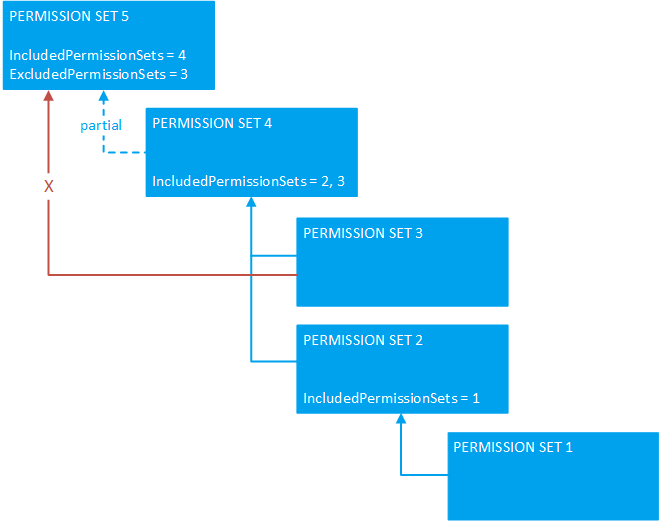
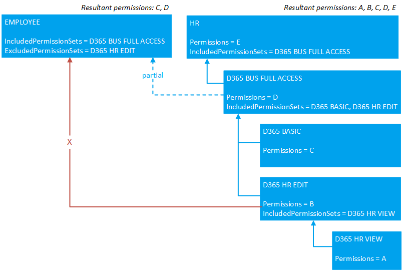

# Composing Permission Sets

Permissions define a specific level of [access to data and objects](devenv-permissions-on-database-objects.md) in the application, like read, insert, modify, and delete permission on table data. Permission sets combine these permissions in logical groups that can then be assigned to users. Permission sets in AL are created using the [permissionset object](devenv-permissionset-object.md), and existing permission sets are extended using the [permissionset extension object](devenv-permissionset-ext-object.md). In the client, administrators can't modify these AL-based permission sets, but they can copy them and modify the copies (learn more in [Assign Permissions to Users and Groups](/dynamics365/business-central/ui-define-granular-permissions)).

## Design concepts

There are different approaches to creating permission sets.

### Fundamental permission sets

One approach is to create a kind of self-contained permission set that includes all the permissions you want to grant to specific data and objects. These permissions are defined explicitly in the [Permissions property](properties/devenv-permissions-property.md) of the permission set or permission set extension object. This approach creates a structure considered to be flat structure.


The disadvantage with this approach by itself is that if you have to change a permission, like C and D in the figure, you have to make the change in every permission set that uses the permission.

### Composite permission sets

Another approach is to use the [IncludedPermissionSets property](properties/devenv-includedpermissionsets-property.md) and [ExludedPermissionSets property](properties/devenv-excludedpermissionsets-property.md) to create permission sets that are composed of the other permission sets. Any changes made to the included or excluded permission sets are automatically propagated to the permission sets that use them. In this manner, you create permission sets that have hierarchical structure, as illustrated in the following figure. In the figure, permission set 5 is composed from all permission sets, minus the permissions in permission set 3.



Composite permission sets are easier to maintain and keep up-to-date compared to fundamental permission sets&mdash;especially when building off Microsoft permission sets. This approach enables you to create concise, reusable permission sets that control access to specific features, which act as building blocks for expanding other permission sets.

### Bringing approaches together

Ultimately, you use a combination of these approaches to meet your permission requirements. Many of the default permission sets from Microsoft follow this approach. The following figure illustrates how different permission sets (in this case, standard Dynamics 365 permission sets) can be used to compose two custom permission sets (EMPLOYEE and HR). The permission sets are simplified for illustration purposes.



## Include permission sets

You use the `IncludedPermissionSets` property to create a permission set that includes permissions from other permission sets. The property is available on permission set and permission set extension objects.

The following code example illustrates a permission set `Sales Person` that includes permissions that grant access, at various levels, to data in different tables. The [Assignable property](properties/devenv-assignable-property.md) is set to `true`, which allows the permission set to be assigned to a user. The [Permissions property](properties/devenv-permissions-property.md) is set to the list of objects to give permissions to. The `RIMD` access assigned to data in the `Customer` table provides full access, whereas, for example, access is limited for data in the `Currency` table only allowing full read and modify permission.

```al
permissionset 50134 "Sales Person"
{
    Assignable = true;
    Caption = 'Sales Person';

    Permissions = 
        tabledata Customer = RIMD,
        tabledata "Payment Terms" = RMD,
        tabledata Currency = RM,
        tabledata "Sales Header" = RIM,
        tabledata "Sales Line" = RIMD;
}
```
  
With the `IncludedPermissionSets` property, you can specify that the permission set `Sales Person` is also included in `MyPermissionSet`.

```al
permissionset 50135 MyPermissionSet 
{ 
    Assignable = true;
    Caption = 'My PermissionSet';
    IncludedPermissionSets = "Sales Person"; 

    Permissions = 
        tabledata Vendor = RIm,
        codeunit SomeCode = x, 
        codeunit AccSchedManagement= X; 
} 
```

The resultant permissions for the `MyPermissionSet` permission set are then:

```al
tabledata Customer = RIMD,
tabledata "Payment Terms" = RMD,
tabledata Currency = RM,
tabledata "Sales Header" = RIM,
tabledata "Sales Line" = RIMD;
tabledata Vendor = RIm,
codeunit SomeCode = x, 
codeunit AccSchedManagement= X; 
```

## Exclude permission sets

With the `ExludedPermissionSets` property, you can remove permissions that are defined in other permission sets from your permission set. The `ExcludePermissionSets` property isn't supported on permission set extension objects.

The following code example illustrates how to use the `ExcludePermissionSets` property. 

```al
permissionset 50136 MyPermissionSet2 
{ 
    Assignable = true;
    Caption = 'My PermissionSet 2';
    IncludedPermissionSets = "MyPermissionSet";
    ExcludedPermissionSets = "Sales Person";

    Permissions = 
        tabledata MyTable  =RIMD,
} 
```

The resultant permissions defined by the `MyPermissionSet2` permission set are then:

```al
tabledata MyTable  = RIMD,
tabledata Vendor = RIm,
codeunit SomeCode = x, 
codeunit AccSchedManagement= X;
```

<!--
## Security filters

Composing permission sets supports security filters. Excluding permission sets currently does not apply security filters
-->

## Rules, guidelines, and tips

This section explains points that can help you get the resultant permissions that you want.

- Permissions are determined by working up the hierarchy, adding or removing permissions at each level.
- Exclude permissions take precedence over included permissions when applied on the same level. If an excluded permission set and included permission set define the same permissions, the excluded permission set permissions are used, overriding the included permission set permissions.
- Direct permissions override indirect permissions.
- When excluded permission sets are used, only permissions are excluded. Security filters from the excluded permission sets aren't used for the negation.

The following table shows how the permissions are determined on a single object when included and excluded permission sets are used:

|Permission Set A|Permission Set B|Result|
|----------------|----------------|------|
|Permissions = tabledata Customer = RI<br>IncludedPermissionSets = B|Permissions = tabledata Customer = iMD|tabledata Customer = RIMD|
|Permissions = tabledata Customer = Ri<br>IncludedPermissionSets = B|Permissions = tabledata Customer = IMD|tabledata Customer = RIMD|
|Permissions = tabledata Customer = RIMD<br>ExcludedPermissionSets = B|Permissions = tabledata Customer = iMD|tabledata Customer = RI|
|Permissions = tabledata Customer = RiMD<br>ExcludedPermissionSets = B|Permissions = tabledata Customer = IMD|tabledata Customer = R|

> [!TIP]
> When including and excluding multiple permission sets, it can be difficult to get an overview of what the resultant permissions will be. To help, use the **View all permissions** action from the the permission set in the client.

## Related information

[Developing extensions](devenv-dev-overview.md)  
[AL development environment](devenv-reference-overview.md)  
[Entitlements and permission set overview](devenv-entitlements-and-permissionsets-overview.md)  
[Permission set extension object](devenv-permissionset-ext-object.md)  
[Permissions on database objects](devenv-permissions-on-database-objects.md)  
[Assignable property](properties/devenv-assignable-property.md)  
[IncludedPermissionSets property](properties/devenv-includedpermissionsets-property.md)  
[Permissions property](properties/devenv-permissions-property.md)
