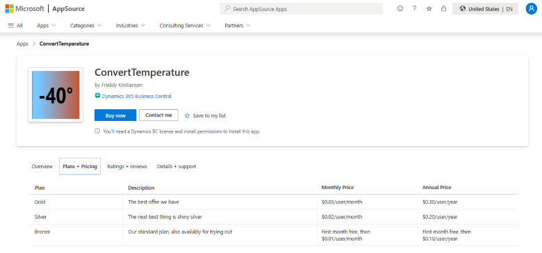
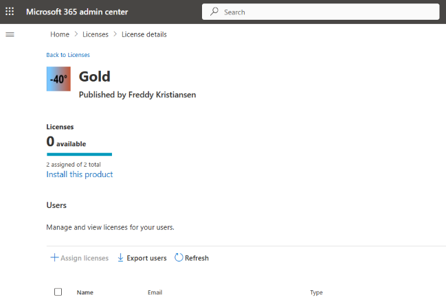

# Selling Business Central apps through AppSource

[!INCLUDE [2023-releasewave2](../includes/2023-releasewave2.md)]

To sell your [!INCLUDE [prod_short](includes/prod_short.md)] app through AppSource, you must first define offers and plans in Partner Center, and map those plans to functionality in your app. Once the transact option is enabled, you can define plans, or variants, of the offer. The plans can then be used to sell various levels of functionality, such as Gold, Silver, and Bronze variants at different prices. Plans can also be used for waterfall pricing, that is when selling the same level of functionality with a discount based on the number of users bought. With waterfall pricing, the price per user decreases as the number of users increases. For each plan, you define the market specifically. The markets supported are the same as the markets supported for Business Central.

With [!INCLUDE [prod_short](includes/prod_short.md)] 2023 release wave 2, transactability based on credit card payment and *per-user licensing* is available for AppSource apps. This means that customers can purchase your app directly in AppSource. The purchase is then automatically provisioned in the customer's Microsoft admin center, and the customer can assign the app licenses to individual users. <!-- For information about Microsoft admin center, see .-->

For pricing, you can optionally decide to define minimum and maximum number of users for the plan. And for billing terms, you can decide to offer monthly and yearly billing, with the option for the customer to choose recurring billing. Under **Free Trial**, you can optionally define a free trial period for the plan. The free trial period is one month, and is automatically enabled for the customer when they purchase the plan in AppSource. Should the customer choose to cancel the subscription during the free trial period, they won't be charged.

## Important steps to take before opting into selling through AppSource

If you already have existing customers on custom licensing, you shouldn't opt in to using transactability and entitlements until you have implemented side-by-side support, which is the ability to fall back to custom licensing for existing customers in a transition period. Without the side-by-side support, your existing customers are locked out once they upgrade to the app version that uses entitlements. To implement the side-by-side support, you must create an entitlement mapping `Unlicensed` user to the required permission sets to run their custom licensing check. For more information, see [Entitlement object](devenv-entitlement-object.md).

It's also recommended to create a dummy app where you can learn and play with functionality first. Furthermore, it's recommended to use private plans only, because this hides the app in AppSource, making it only accessible to yourself, and anyone that you have given access to, in order to the test app.

## The process of enabling transactability

The following steps outline the process of enabling transactability for your app, assuming that you already have an existing offer in AppSource. If you don't have an existing offer in AppSource, read more here [Create a Dynamics 365 Business Central offer](/partner-center/marketplace/dynamics-365-business-central-offer-setup). Having assured any transition period for your app by setting up side-by-side support, you can enable transactability for your app. The following outlines the steps to take:

- In Partner Center, on your existing offer, under **Setup details**, select the option called **Would you like to sell through Microsoft?**, choose the **Yes, I would like to sell through Microsoft and have Microsoft host transactions on my behalf** option to opt into transactability.  

- Once you have enabled transactability, you can define plans for your offer. In Partner Center, on your offer, select the **Plan overview** tab, and then choose **Add plan**. For more information, see [Plans](devenv-sell-apps-appsource.md#plans).

- When you have defined the plans, you can map these plans to functionality in your app. You do this by creating entitlements in your app, which map the license to object entitlements. For more information, see [Mapping plans to functionality in your app](devenv-sell-apps-appsource.md#mapping-plans-to-functionality-in-your-app). 
- Having opted into transactability, defined plans, and mapped these plans to functionality in your app by using entitlements, you can now publish your app. Your app goes through the AppSource validation process, and once it's published, users can purchase your app directly in AppSource.

- When customers buy your app, they get a license for the plan, and they can go to the Microsoft 365 admin center, and then choose **Licenses**, and then they can see the license for the app, which they can assign to users. For more information, see [Assign licenses to users](/microsoft-365/admin/manage/assign-licenses-to-users?view=o365-worldwide&preserve-view=true).

## Plans

When you have opted into transactability for your app, it's time to define plans for your offer. Plans are defined as the different sellable SKUs.
To set up plans, go to Partner Center, and on your offer, select the **Plan overview** tab, and then choose **Add plan**. 

The pricing model is a per-user model, where you can choose to define the price per user per month or per year. The plan can either be public, which means that it's shown in AppSource, or private, which means that it's only shown to customers that the publisher has specified. Each plan can specify the supported markets, and can have market-specific pricing. The markets supported are the same as the markets supported for Business Central.

## Mapping plans to functionality in your app

Having defined the plans in Partner Center, you must map these to entitlements in your app. Entitlements are defined as AL objects and they map to the plans in Partner Center by using the *Service ID* of the plan. On the plan, you find the *Service ID*, which is a combination of the publisher tenant identity, the offer identity, and the plan identity. The *Service ID* is used to map the plan to functionality in the app by using entitlements objects in their [!INCLUDE [prod_short](includes/prod_short.md)] app. Entitlements also allow mapping access to delegated admins, and publisher developers, so that these can run the app without any purchased license, for example, to demo, configure, test, or troubleshoot. For more information, see [Entitlement object](devenv-entitlement-object.md).

## Purchasing your app

When the app has been updated with entitlements, it must be published to AppSource and go through the validation process. Once it's been validated, it surfaces in AppSource with the different plans and pricing, allowing customers to purchase directly in the AppSource marketplace. Once licenses have been purchased, they appear in the customers Microsoft 365 admin center, and can be assigned to individual users. For more information, see [Use the Licenses page to assign licenses to users](/microsoft-365/admin/manage/assign-licenses-to-users?view=o365-worldwide&preserve-view=true#use-the-licenses-page-to-assign-licenses-to-users).

> [!NOTE]  
> Even if a user has an assigned license (plan) that maps to permission sets through the entitlement for that license, the user must still be granted those permissions inside [!INCLUDE [prod_short](includes/prod_short.md)] to have access. In other words, the license only defines the maximum permission to app functionality paid for, but users with the license might be granted less inside [!INCLUDE [prod_short](includes/prod_short.md)].

## Preview of your app

The publisher of an AppSource app might run a preview for a future version of an already public app, or new app. Preview versions can be installed using a URL including a `PreviewKey` parameter provided by the app publisher, but only in sandbox environments. For more information, see [Preview versions of AppSource apps](../administration/tenant-admin-center-manage-apps.md#preview-versions-of-appsource-apps).

## Get insights into your app

Once your app is published, you can get insights into how your app is doing. The commercial marketplace insights tool on Partner Center allows you to access dashboards and reports to analyze data related to your offers, customers, transactions, and other activities on the marketplace. For more information, see [Insights for your app](/partner-center/analytics).

## Side-by-side support

The side-by-side support is the ability to fall back to custom licensing for existing customers in a transition period. It's crucial that you implement side-by-side support for your app before opting into transactability on AppSource. To enable side-by-side support, you must create an entitlement, which maps the user to the required permission sets to run their custom licensing. On the entitlement object, you must set the `Type` property to `Unlicensed`. For more information, see [Entitlement object](devenv-entitlement-object.md). 

## Sell your transactable apps through the CSP reseller network

As an ISV you can seamlessly license and resell your transactable apps through the managed CSP reseller network, complete with a margin-sharing option for enhanced profitability. For more information, see:

- ISV to CSP private offers FAQs: [Independent Software Vendor (ISV) to Partner private offers FAQ](/partner-center/marketplace/isv-csp-faq).  
- ISV resells through CSP: [Cloud Solution Provider - Microsoft commercial marketplace](/partner-center/marketplace/cloud-solution-providers).

## Related information

[FAQ about the Microsoft commercial marketplace](/partner-center/marketplace/marketplace-faq-publisher-guide)  
[Entitlement object](devenv-entitlement-object.md)  
[Sell Business Central apps through AppSource - release plan](/dynamics365/release-plan/2023wave2/smb/dynamics365-business-central/sell-business-central-apps-through-appsource)  
[Create a Dynamics 365 Business Central offer](/partner-center/marketplace/dynamics-365-business-central-offer-setup)
