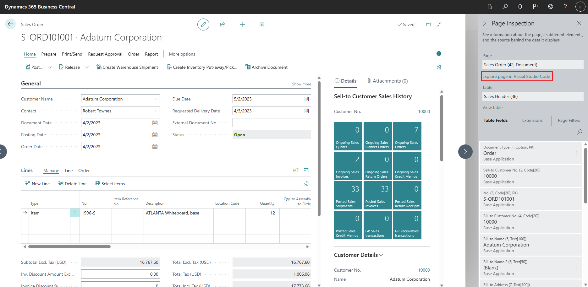
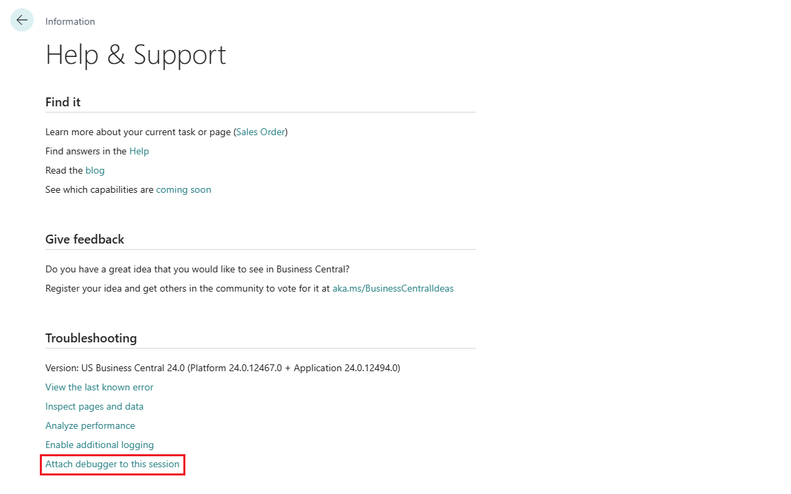

# Troubleshoot in Visual Studio Code directly from the web client

With [!INCLUDE [prod_short](includes/prod_short.md)] 2023 release wave 2, you can open a new Visual Studio Code session directly from the web client for a specific customer production or sandbox environment. Opening the session directly, enables performing troubleshooting, such as debugging, inspecting variables, setting breakpoints, and viewing source code.

Depending on the context, Visual Studio Code opens to allow inspecting objects and source, and allows attaching to debug or snapshot debug and profile the current web client session. Whether you can access the source code is gated by the resource exposure profile settings for each extension. Learn more in [Resource exposure policy setting](devenv-security-settings-and-ip-protection.md).

From the [!INCLUDE [prod_short](includes/prod_short.md)] web client, you can open Visual Studio Code in the following ways:

- Open a page from the [Page Inspector](devenv-troubleshoot-vscode-webclient.md#open-a-page-from-the-page-inspector)
- Troubleshoot the current session from within [Help and Support](devenv-troubleshoot-vscode-webclient.md#troubleshoot-from-the-help-and-support-page)
- Generate launch.json files directly from the web client 
- Generate dependencies directly fro the web client 

## Open a page from the Page Inspector

From a page in the [!INCLUDE [prod_short](includes/prod_short.md)] web client, you can open the **Page Inspection** page and explore the code behind it in Visual Studio Code. Learn more about page inspection in [Page inspection](devenv-inspecting-pages.md).

To open and explore a page from the Page Inspector, follow these steps:

1. Locate the page that you want to inspect.
1. From that page, run the **Page Inspection** with <kbd>Ctrl</kbd>+<kbd>Alt</kbd>+<kbd>F1</kbd>.
1. Choose the **Explore page in Visual Studio Code** link.  
1. Next, to open a Visual Studio Code instance, you must choose the **Open** button in the **Allow an extension to open this URI?** dialog. If you already have Visual Studio Code running that instance opens.
1. Then, you must specify, if you want to create a new project, or use an existing project. You're only asked the first time, and from then on, the Visual Studio Code window that was last active is used.
1. Next, you must decide if you want to download symbols.  
    > [!NOTE]  
    > If you specify yes, the app.json file will be updated with the dependent extensions of the page, which are shown on the **Extensions** tab in the **Page Inspection** page, and the symbols will automatically be downloaded. You can specify no, if you're already working on the specific source code files.  
    > If you say no, and don't have the right symbols downloaded, you won't be able to navigate to the object source code.
1. Now, you're prompted whether to do a snapshot or regular debugging session, or not to debug, but just view the source code.  
    > [!NOTE]  
    > For production environments, regular debugging isn't supported.
1. If you want to debug, then set breakpoints and go back to the web client to run the task. When the breakpoint is hit, you can inspect the code in Visual Studio Code.  

You can also choose to inspect a specific field on a page.

1. Locate the page that you want to inspect.
1. From that page, run the **Page Inspection** with <kbd>Ctrl</kbd>+<kbd>Alt</kbd>+<kbd>F1</kbd>.
1. Choose the field to inspect, select the dropdown menu, and then choose **Explore field in VS Code**. The source code for the table field definition behind the page field is now opened.

## Troubleshoot from the Help and Support page

In the [!INCLUDE [prod_short](includes/prod_short.md)] web client, you can open the **Help and Support** page and explore the code behind it in Visual Studio Code.

To attach the debugger to a session, do the following:

1. Go to the **Help and Support** page, and then choose the **Attach debugger to this session** link under the **Troubleshooting** section.
1. Next, to open a Visual Studio Code instance, you must choose the **Open** button in the **Allow an extension to open this URI?** dialog. If you already have Visual Studio Code running that instance opens.
1. Then, you must specify, if you want to create a new project, or use an existing project. You're only be asked the first time, and from then on, the Visual Studio Code window that was last active is used.
1. If you want to debug, then set breakpoints and go back to the web client to run the task. When the breakpoint is hit, you can inspect the code in Visual Studio Code.  
    > [!NOTE]  
    > For production environments, regular debugging isn't supported.

## Open source code in Visual Studio Code

[!INCLUDE [2024-releasewave2](../includes/2024-releasewave2.md)]

With the **Open Source in VS Code** option, you can get the latest source code from an extension and open it directly in Visual Studio Code. The open source functionality uses the repo metadata that was included in the extension when it was built. In the manifest of an extension, the `app.json` file, you can specify metadata for where the related GitHub repository and a specific build are found by using the `build` and `source` settings. Learn more in [JSON files](devenv-json-files.md#appjson-file).

Opening the source code enables investigating issues or developing new functionality based on an existing extension. You must have access to the code through GitHub to be able to open the source code through Visual Studio Code.

Follow these steps:

1. Open the **Extension Management** page and activate the context menu for the selected extension. 
1. Choose the **Open Source in VS Code** option.  
  In Visual Studio Code, you're now asked if you want to clone or open the GitHub repo for the extension. If you choose to clone the repo, you must specify where you want to clone the repo to on your local computer.  
3. Once the repo is cloned, you have different options for working with the source code. You can, for example, stay on the current main branch, or you can create a new branch for your modification.  
  If you choose to create a new branch, you must give it a name.
4. With access to the source code on your local computer, you can, for example, use the Page Inspector to help you navigate to the source code by using the **Explore page in Visual Studio Code** functionality. Learn more in [Open a page from Page Inspector](#open-a-page-from-the-page-inspector).

## Generate launch configuration files directly from the web client

[!INCLUDE [2025rw1_and_later](includes/2025rw1_and_later.md)]

You can generate and update launch.json files directly from the web client. Instead of manually creating the launch.json file in Visual Studio Code, you can generate it directly from the [!INCLUDE [prod_short](includes/prod_short.md)] web client for a specific environment. This is especially useful for troubleshooting and debugging scenarios, as it allows you to quickly set up the necessary configurations without having to switch between different tools or environments.

You can generate and update launch.json files from the **Help & Support** page in [!INCLUDE [prod_short](includes/prod_short.md)]. To do this, follow these steps:

1. In [!INCLUDE [prod_short](includes/prod_short.md)], go to the **Help & Support** page.
1. Under **Troubleshooting**, choose the **Generate launch configurations for this environment** link.

Or, you can generate launch.json files from the **Extension Management** page. 

1. In [!INCLUDE [prod_short](includes/prod_short.md)], go to the **Extension Management** page.
1. Choose the extension that you want to generate launch configurations for.
1. Now, choose the **Develop in VS Code** action group, and then the **Generate launch configurations** action.

Visual Studio Code then generates or updates launch configurations for deploy, attach, and snapshot configurations matching the specific environment, including the user session information.

## Generate extension dependencies directly from the web client

[!INCLUDE [2025rw1_and_later](includes/2025rw1_and_later.md)]

You can generate extension dependencies directly from the web client. Instead of manually creating the dependencies file in Visual Studio Code, you can generate it directly from the [!INCLUDE [prod_short](includes/prod_short.md)] web client for a specific environment. There are two options for generating the dependencies; you can either **Download in VS Code** or **Show and copy** as illustrated in the image below.

:::image type="content" source="media/develop-in-vs-code-dependencies.png" alt-text="Options for generating extension dependencies directly":::

## Good to know

- If Visual Studio Code is already open, the last active session is used; otherwise, a new Visual Studio Code session opens. If the AL Language extension isn't installed, the user is asked to install it, and the process ends.
- When invoked, a new project is created, and a matching launch configuration is created, depending on the current environment being a production or sandbox environment.
- If the user chooses to debug, Visual Studio Code attaches to the web client process, which it was invoked from and awaits breaking on error.
- If reusing a project and the source files aren't up to date with the version on the server, the breakpoints won't be hit correctly when debugging. Learn more in [Snapshot debugging](devenv-snapshot-debugging.md).
- When you choose to generate new projects, remember to delete the projects occasionally to not accumulate many unused projects.
- Running the web client in a browser, you're typically not running the browser as an administrator, which means that Visual Studio Code also doesn't open in administrator mode. So, for example, if Visual Studio Code prompts you for an update, and you choose yes, you get an error, because you don't have permissions to update. It's then recommended to shut down Visual Studio Code, and reopen it as an administrator and update it. Then, you can continue debugging.

## Related information

[Resource exposure policy setting](devenv-security-settings-and-ip-protection.md)  
[Debugging](devenv-debugging.md)  
[Snapshot debugging](devenv-snapshot-debugging.md)  
[Page inspection](devenv-inspecting-pages.md)  