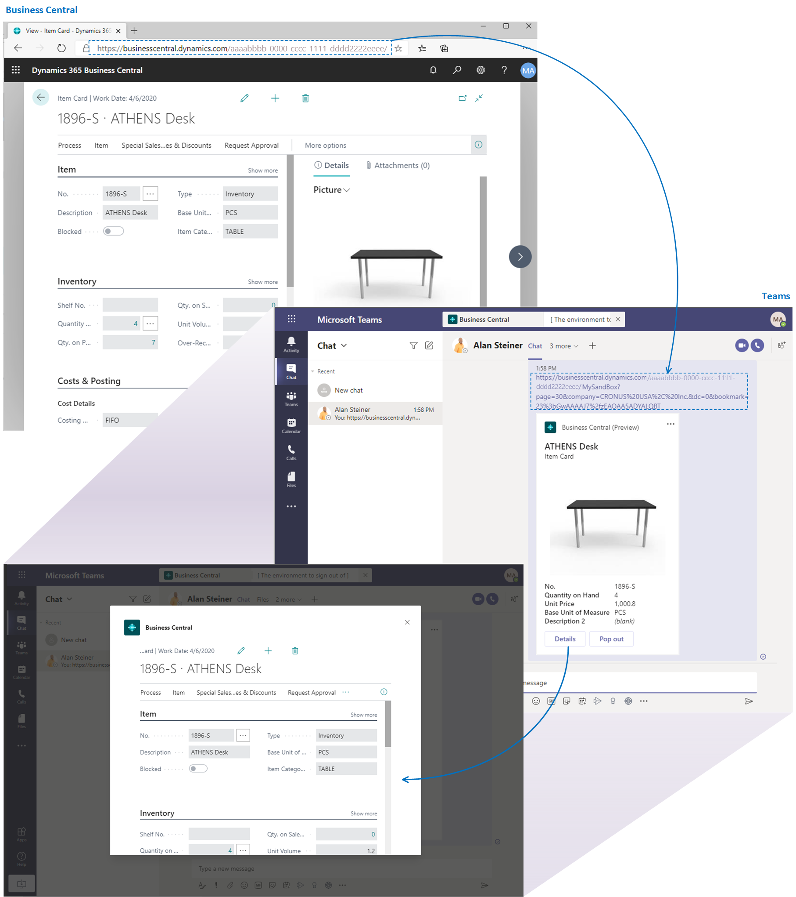

# Integrating Business Central with [!INCLUDE[m365](includes/m365-name.md)]

[!INCLUDE[prod_short](../includes/prod_short.md)] supports multiple integrations to [!INCLUDE[m365](includes/m365-name.md)]. Enabling integrations to [!INCLUDE[m365](includes/m365-name.md)], augments the functionality in [!INCLUDE [prod_short](../includes/prod_short.md)] with additional features. 

In this article, we introduce some of these additional features.

## Using [!INCLUDE[m365_excel](includes/m365-excel-name.md)] with [!INCLUDE [prod_short](../includes/prod_short.md)]

[!INCLUDE[m365_excel](includes/m365-excel-name.md)] is used in [!INCLUDE [prod_short](../includes/prod_short.md)] in the following scenarios:

1. Viewing and/or editing [!INCLUDE [prod_short](../includes/prod_short.md)] data in Excel.
1. To support analytical reporting.

:::image type="content" source="media/connect-to-excel.svg" alt-text="Shows how AL apps/extensions can call Azure or Microsoft services from Business Central" lightbox="media/connect-to-excel.svg":::

With pages that display a list of records in rows and columns, like a list of customers, sale orders, or invoices, you can export the list to [!INCLUDE[m365_excel](includes/m365-excel-name.md)], and view it there. Depending on the page, you have two options: Either *Open in Excel*, which opens the data as read-only, or *Edit in Excel*, which allows you to save changes back to BC. For more information, see [Using Excel for Viewing and Editing Business Central data](/dynamics365/business-central/across-work-with-excel).

Power users can use Excel as the design tool for the layout of analytical reports. These reports can the be run by any user that has access to them. For more information, see [Using Excel to design analytical reports](/dynamics365/business-central/ui-excel-report-layouts?tabs=any-report)

> [!TIP]
> If you also enable integration to [!INCLUDE[m365_onedrive_for_business](includes/m365-onedrive-for-business-name.md)], Excel workbooks from [!INCLUDE [prod_short](../includes/prod_short.md)] are opened in your browser by using Excel for the web. 

## Integrating to [!INCLUDE[m365_graph](includes/m365-graph-name.md)] (from AL code)

You can connect to and work with the [!INCLUDE[m365_graph](includes/m365-graph-name.md)] with just a few lines of AL code. The module works as a wrapper of the [!INCLUDE[m365_graph](includes/m365-graph-name.md)] REST API. 

:::image type="content" source="media/connect-to-m365-services.svg" alt-text="Shows how AL apps/extensions can call Azure or Microsoft services from Business Central" lightbox="media/connect-to-m365-services.svg":::

As an AL developer, you can use the module to do the following tasks:
- Create a [!INCLUDE[m365_graph](includes/m365-graph-name.md)] authorization.
- Initialize the [!INCLUDE[m365_graph](includes/m365-graph-name.md)] Client.
- Process GET,PATCH,POST,DELETE requests with [!INCLUDE[m365_graph](includes/m365-graph-name.md)].

For more information, see [Microsoft Graph (System Application reference)](https://github.com/microsoft/BCApps/tree/main/src/System%20Application/App/MicrosoftGraph).  

## Integrating to [!INCLUDE[m365_onedrive_for_business](includes/m365-onedrive-for-business-name.md)]

[!INCLUDE[m365_onedrive_for_business](includes/m365-onedrive-for-business-name.md)] is a cloud storage service that is included in Microsoft 365. [!INCLUDE[prod_short](../includes/prod_short.md)] makes it easy to store, manage, and share files with other people through OneDrive. 

When [!INCLUDE[m365_onedrive_for_business](includes/m365-onedrive-for-business-name.md)] is enabled in [!INCLUDE[prod_short](../includes/prod_short.md)], additional functionality becomes available such as 

- New actions *Open in OneDrive* and *Share* actions are now available on most pages where files are available, such as the Report Inbox or where files are attached to records. 
- The *Open in Excel* and *Edit in Excel* actions on list pages will automatically copy the Excel file to OneDrive, then open it in Excel Online. 
- Sending a report to an Excel or Word file will automatically copy the file to OneDrive, then open it in Excel or Word online. 

:::image type="content" source="/dynamics365/business-central/media/one-drive-attachments-w-outline.png" alt-text="The Open in OneDrive and Share actions for attachments" lightbox="/dynamics365/business-central/media/connect-to-azure-services.svg":::

For more information, see [Integrating with Onedrive for Business overview](/dynamics365/business-central/across-onedrive-overview).

With [!INCLUDE[prod_short](../includes/prod_short.md)] online, the connection between [!INCLUDE[prod_short](../includes/prod_short.md)] and OneDrive is automatically configured, and the OneDrive features are readily available to users by default. With [!INCLUDE[prod_short](../includes/prod_short.md)] on-premises, it requires more set. For more information, see [Managing OneDrive Integration with Business Central](/dynamics365/business-central/admin-onedrive-integration).

## Using [!INCLUDE[m365_outlook](includes/m365-outlook-name.md)] with [!INCLUDE [prod_short](../includes/prod_short.md)]

With [!INCLUDE [prod_short](../includes/prod_short.md)], you can manage business interactions with your customers and vendors, directly in [!INCLUDE[m365_outlook](includes/m365-outlook-name.md)]. By installing the [!INCLUDE [prod_short](../includes/prod_short.md)] add-in for [!INCLUDE[m365_outlook](includes/m365-outlook-name.md)], you get the following two capabilities:

1. Contact insights. This add-in lets you look up [!INCLUDE [prod_short](../includes/prod_short.md)] customer or vendor information in [!INCLUDE[m365_outlook](includes/m365-outlook-name.md)] emails and calendar appointments. It also lets you create and send emails including [!INCLUDE [prod_short](../includes/prod_short.md)] business documents, such a sales quote or invoice to a contact.

1. Document view. When a business document is sent in an email, the add-in provides a direct link from email to the actual business document in [!INCLUDE [prod_short](../includes/prod_short.md)].

:::image type="content" source="/dynamics365/business-central/media/outlook-attach-files.png" alt-text="Shows how to add attachments from an email to records in Business Central" lightbox="/dynamics365/business-central/media/outlook-attach-files.png":::

For more information, see [Using Outlook with Business Central](/dynamics365/business-central/admin-outlook).

## Integrating to [!INCLUDE[m365_sharepoint](includes/m365-sharepoint-name.md)] (from AL code)

Connect to and work with storage accounts, containers, and blobs from Sharepoint in your AL code. The module works as a wrapper of the [!INCLUDE[m365_sharepoint](includes/m365-sharepoint-name.md)] REST API. 

:::image type="content" source="media/connect-to-azure-services.svg" alt-text="Shows how AL apps/extensions can call Azure or Microsoft services from Business Central" lightbox="media/connect-to-azure-services.svg":::

As an AL developer, you can use the module to do the following tasks:
- Connect to and authenticate a session in SharePoint
- Perform basic operations with SharePoint files, folders, lists, list items, and list attachments.

For more information, see [SharePoint (System Application reference)](https://github.com/microsoft/BCApps/tree/main/src/System%20Application/App/SharePoint).  

## Integrating to [!INCLUDE[m365_teams](includes/m365-teams-name.md)]

You can integrate [!INCLUDE[prod_short](../includes/prod_short.md)] apps/extensions with [!INCLUDE[m365_teams](includes/m365-teams-name.md)]. [!INCLUDE [prod_short](../includes/prod_short.md)] offers an app that connects [!INCLUDE[m365_teams](includes/m365-teams-name.md)] to the data in [!INCLUDE [prod_short](../includes/prod_short.md)] so that users can quickly share details across team members and respond faster to inquiries. 

For more information, see [Integrating with Microsoft Teams overview](../developer/devenv-develop-for-teams.md).

## Using [!INCLUDE[m365_word](includes/m365-word-name.md)] with [!INCLUDE [prod_short](../includes/prod_short.md)]

[!INCLUDE[m365_word](includes/m365-word-name.md)] is used in [!INCLUDE [prod_short](../includes/prod_short.md)] in the following scenarios:

First, if an organization wants to change the layout of their outgoing documents such as quotes, sales orders, or sales invoices, a power user can use Word as the design tool changing the layout. For more information, see [Using Word Templates for Bulk Communication](/dynamics365/business-central/ui-how-add-fields-word-report-layout).

:::image type="content" source="/dynamics365/business-central/media/word-layout.png" alt-text="Shows how AL apps/extensions can call Azure or Microsoft services from Business Central" lightbox="/dynamics365/business-central/media/word-layout.png":::

Second, to can make it easy to mass communicate in print or email, you can Word templates in [!INCLUDE [prod_short](../includes/prod_short.md)] to merge data from entities such as contacts, customers, and vendors with a Word mail merge document. For more information, see [Using Word for Document Report Layouts](/dynamics365/business-central/ui-mail-merge).

## See also

[Using Excel for Viewing and Editing Business Central data](/dynamics365/business-central/across-work-with-excel)  
[Using Excel to design analytical reports](/dynamics365/business-central/ui-excel-report-layouts?tabs=any-report)  
[Integrating with Microsoft Graph (System Application reference)](https://github.com/microsoft/BCApps/tree/main/src/System%20Application/App/MicrosoftGraph)  
[Integrating with Onedrive for Business overview](/dynamics365/business-central/across-onedrive-overview)  
[Using Outlook with Business Central](/dynamics365/business-central/admin-outlook)  
[Integrating with SharePoint (System Application reference)](https://github.com/microsoft/BCApps/tree/main/src/System%20Application/App/SharePoint)  
[Integrating with Microsoft Teams overview](../developer/devenv-develop-for-teams.md)   
[Using Word Templates for Bulk Communication](/dynamics365/business-central/ui-how-add-fields-word-report-layout)  
[Using Word for Document Report Layouts](/dynamics365/business-central/ui-mail-merge)  
