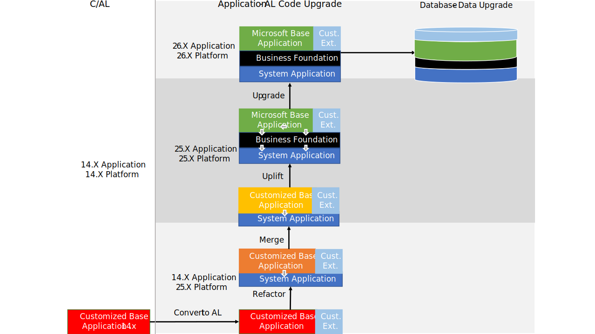

# Upgrading to Dynamics 365 Business Central 2025 release wave 1

[!INCLUDE[prod_short](../developer/includes/prod_short.md)] 2025 release wave 1 (version 26) is the 11th major release that is fully AL-based. [!INCLUDE[prod_short](../developer/includes/prod_short.md)] 2019 release wave 2 (version 15) marked the release in which C/AL was replaced by AL. The classic development environment, known as C/SIDE, was deprecated. From an application perspective, [!INCLUDE[prod_short](../developer/includes/prod_short.md)] is now extension-based only. The [!INCLUDE[prod_short](../developer/includes/prod_short.md)] base application is delivered as an AL extension. Also, application functionality that isn't related to the business logic has moved into separate modules. These modules are combined into an extension known as the System Application. This change influences how you do the upgrade compared to earlier releases.

## Upgrade path

Depending on your current version, a direct upgrade to version 26 isn't always possible. You might have to first upgrade to an intermediate version. The following table describes the upgrade paths for supported versions:

[!INCLUDE[upgrade-path-v26](../developer/includes/upgrade-path-v26.md)]

Your current version doesn't have to be the latest update for the version. However, for intermediate versions, use to the latest available update.

## Upgrade overview

When upgrading your [!INCLUDE[prod_short](../developer/includes/prod_short.md)] Spring 2019 (version 14) solution, you must first upgrade to version 15. The goal is to move towards a full uptake of the [!INCLUDE[prod_short](../developer/includes/prod_short.md)] base and system applications, as they are, and migrating code customizations to add-on extensions. There are different upgrade levels that you follow to get to this state, as illustrated in the following figure. We recommend that you refactor to the system application as a minimum.

## New and changed features

There are several new and changed platform and application features available in [!INCLUDE[prod_short](../developer/includes/prod_short.md)] 2025 release wave 1. These changes affect users, administrators, and developers. Learn more at [Overview of Dynamics 365 Business Central 2025 release wave 1](/dynamics365/release-plan/2025wave1/smb/dynamics365-business-central/planned-features).

## Business Foundation extension

This extension was introduced in version 24 and currently contains objects and logic for number series, which was previously part of the base application. It will contain more functionality in future releases. The base application now has a dependency on the business foundation extension in addition to the system application. This change affects the upgrade process because the business foundation extension needs to be published and installed on the tenant before the base application.

## Deprecated features

Before you upgrade, review the following articles to get an overview of features deprecated in this release:

- [Deprecated Features in W1](deprecated-features-w1.md)
- [Deprecated Features in the Platform](deprecated-features-platform.md)
- [Deprecated Tables](deprecated-tables.md)

From these articles, use the links in the table of contents to view more deprecated features, like features specific to local versions.

## Migrate to Business Central online

You can upgrade to [!INCLUDE[prod_short](../developer/includes/prod_short.md)] online from supported versions of [!INCLUDE[prod_short](../developer/includes/prod_short.md)] on-premises, as long as extensions handle your application customizations.

The process consists of two parts:

- Convert nonstandard functionality and customizations to apps and per-tenant extensions. Learn more in [Deploying a Tenant Customization](../developer/devenv-deploy-tenant-customization.md).
- Run the cloud migration tool, and then switch to use [!INCLUDE[prod_short](../developer/includes/prod_short.md)] online going forward.

Learn more [Migrate on-premises data to Business Central online](../administration/migrate-data.md).

## Related information  

[Upgrading to Business Central](upgrading-to-business-central.md)  
[Upgrading Extensions](../developer/devenv-upgrading-extensions.md)  
[[!INCLUDE[prod_long](../developer/includes/prod_long.md)] Upgrade Compatibility Matrix](upgrade-v14-v15-compatibility.md)  
