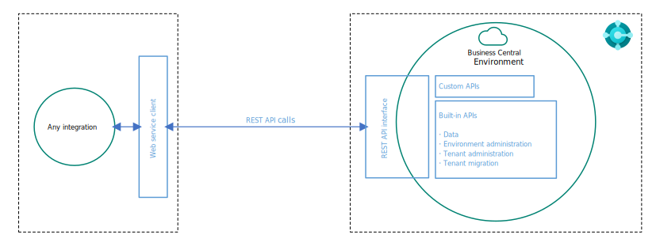

# REST API web services

RESTful web services are typically created to interchange data between [!INCLUDE[prod_short](../developer/includes/prod_short.md)] and external systems. The acronym REST stands for REpresentational State Transfer. Any coding language capable of calling REST APIs can be used to use this feature. The [!INCLUDE[prod_short](../developer/includes/prod_short.md)] API stack is optimized for performance and is the preferred way to integrate with [!INCLUDE[prod_short](../developer/includes/prod_short.md)].

[!INCLUDE[prod_short](../developer/includes/prod_short.md)] comes with an extensive list of built-in APIs that requires no code and minimal setup to use. When using the built-in APIs, please choose the highest API version available. You can also develop your own custom APIs using the AL object types _API pages_ and _API queries._

The articles in this section describe the key concepts and techniques for using APIs with [!INCLUDE[prod_short](../developer/includes/prod_short.md)].
  
|To|See|  
|--------|---------|  
|Learn about ways to improve the performance of API calls | [API client performance](odata-client-performance.md) |  
|Troubleshoot failed API calls | [Troubleshooting API calls](../api-reference/v2.0/dynamics-error-codes.md) |  
| Learn about best practices when working with APIs| [Tips for working with APIs](../developer/devenv-connect-apps-tips.md)  [Using filters with API calls](../developer/devenv-connect-apps-filtering.md) |  
| Get a list of Business Central environments (needed when calling the other APIs) |[Environment list API](api-get-environments.md)   |  
|Explore the built-in API for reading Business Central data | [Business Central API (v2.0)](../api-reference/v2.0/index.md) |  
|Transition from API v1.0 to API v2.0 when reading Business Central data | [Transitioning from API v1.0 to API v2.0](../api-reference/v2.0/transition-to-api-v2.0.md) |  
|Use APIs to automate tasks on an environment | [Administration API](../administration/itpro-introduction-to-automation-apis.md) |
|Use APIs to automate environment administration tasks | [Admin Center API](../administration/administration-center-api.md) |
|Use APIs to automate environment cloud migration tasks | [Cloud Migration API](../administration/cloudmigrationapi/cloud-migration-api-overview.md) |
|Develop a custom API for reading Business Central data | [API Developer Overview](../developer/devenv-api.md)   [API Page Type](../developer/devenv-api-pagetype.md)   [API Query Type](../developer/devenv-api-querytype.md)   [Walkthrough: Developing a Custom API](../developer/devenv-develop-custom-api.md) |
|Enable built-in API (for on-premises) | [Enabling the API for Dynamics 365 Business Central](../api-reference/v2.0/enabling-apis-for-dynamics-nav.md)|
|Learn more about the structure of the API endpoints | [API endpoint structure](../../webservices/api-endpoint-structure.md)|

## Related information

[Web services overview](web-services.md)   
[Integration overview](../developer/integration-overview.md)  
